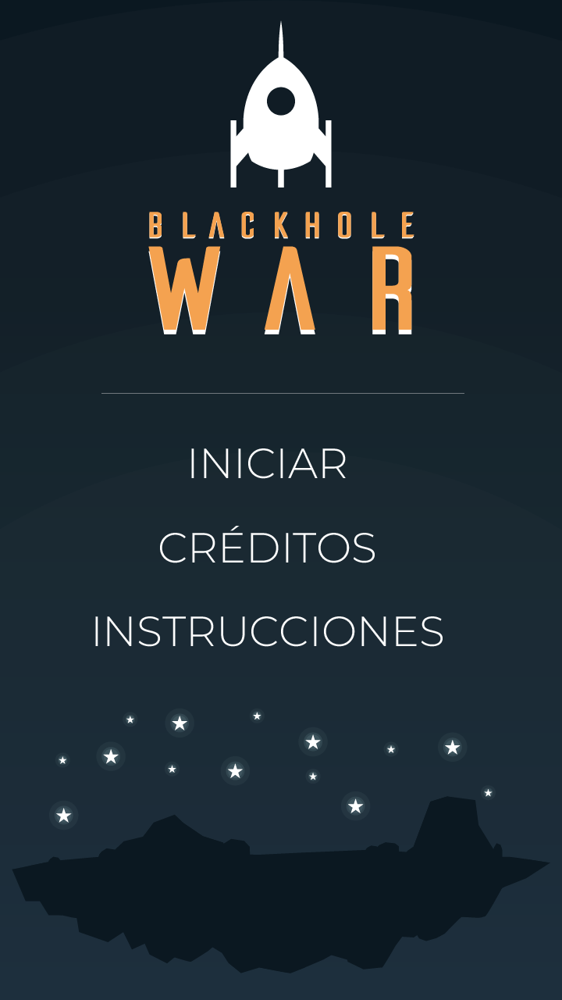
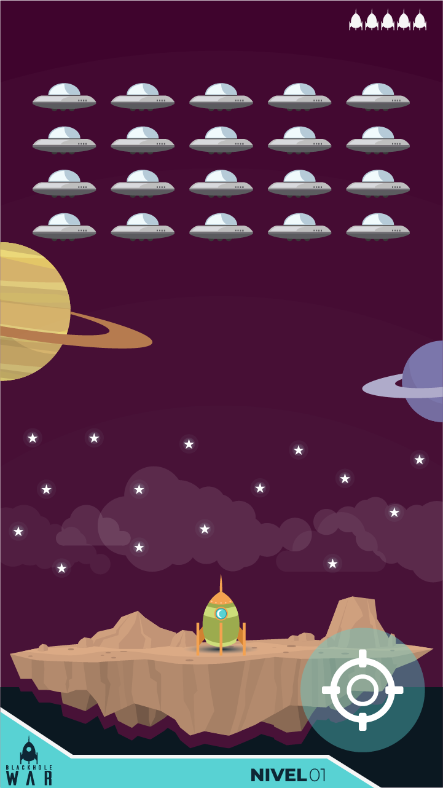

# Blackhole War - Mini Juego para Android (Adobe Flash & AS3)

¡Hola! :) En este repositorio les comparto un proyecto muy especial: un mini juego estilo *Space Invaders* llamado **Blackhole War** que desarrollé de forma nativa para dispositivos Android. Fue un gran reto técnico en su momento, ya que diseñé toda la interfaz desde cero y programé la lógica del juego para que reaccionara a los sensores físicos del teléfono (Esto lo hice en mi etapa de docente en La Metro Design).

## 🚀 ¿Cómo lo construí y cómo se juega?

Este juego combinó el diseño vectorial con la programación de eventos móviles de la siguiente manera:

* **Diseño e Interfaz:** Diseñé todos los elementos visuales (la nave, los ovnis enemigos, los planetas y los botones) en **Adobe Illustrator** para que fueran vectores limpios. Luego, importé todo a **Adobe Flash** como movieclips para armar las escenas y las animaciones.
* **Movimiento con el Acelerómetro:** En lugar de usar botones clásicos para mover la nave, programé el juego en **ActionScript 3 (AS3)** para que consumiera los datos del acelerómetro del teléfono. Así, el jugador solo tenía que inclinar el celular hacia la izquierda o derecha para dirigir la nave.
* **Disparos táctiles:** Diseñé un botón con forma de mira en la esquina inferior derecha de la pantalla (como puedes ver en `image_aefc3f.png`). Programé los eventos de la pantalla táctil (*touch screen events*) para que, al presionarlo, la nave abriera fuego contra los invasores.

## 🛠️ Tecnologías y herramientas que utilicé

* **Diseño Gráfico:** Adobe Illustrator.
* **Entorno de Desarrollo y Animación:** Adobe Flash Player / Adobe Animate.
* **Lenguaje de Programación:** ActionScript 3 (AS3).
* **Despliegue Móvil:** Adobe AIR (para compilar y empaquetar el instalador `.apk`).

## 📸 Capturas del Proyecto

Aquí puedes ver cómo quedó el diseño visual y la interfaz del juego:

  
  

## 💡 Los mayores desafíos de este proyecto

Llevar un juego de la computadora al celular en esa época tuvo retos muy interesantes:

1. **Optimización móvil:** Controlar que la cantidad de enemigos y disparos en pantalla no bajaran los fotogramas por segundo (*FPS*) del celular, manteniendo la experiencia fluida.
2. **Eventos físicos del hardware:** Lograr la calibración correcta del acelerómetro para que el movimiento de la nave se sintiera natural y no demasiado brusco o lento.
3. **El empaquetado y firmado:** Uno de los dolores de cabeza más comunes de la época era crear correctamente la llave de seguridad autofirmada dentro de Adobe Flash para que se pudiera exportar el archivo APK sin errores, permitiendo instalarlo directamente en cualquier dispositivo Android con permisos de administrador.

---
*Un proyecto que disfruté muchísimo programando y que me permitió explorar el potencial de los sensores físicos en los inicios del desarrollo de videojuegos móviles con Adobe Flash y AS3.*